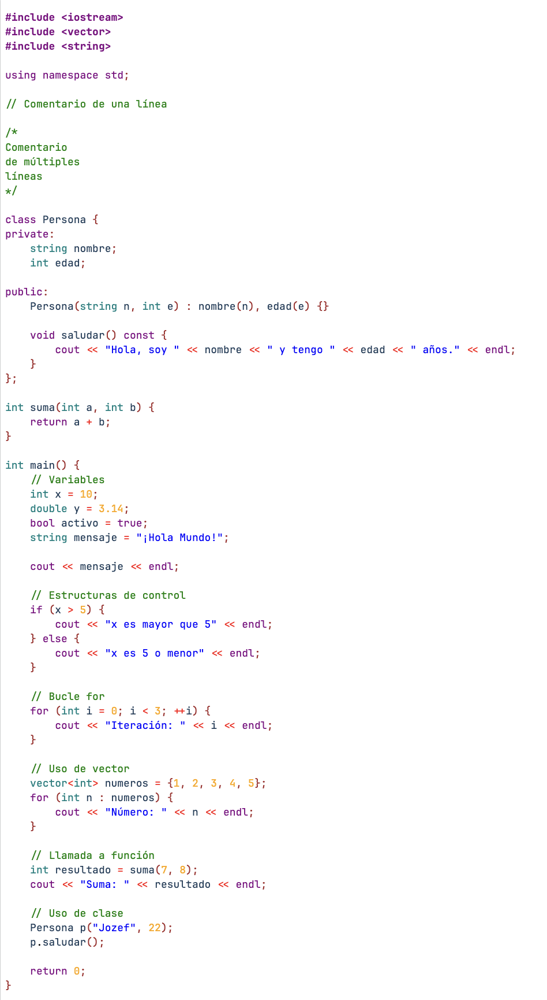

# Lexical Highlighter

LexicalHighlighter is a simple Ruby script that performs lexical highlighting for C++ source code. It reads a C++ code file, applies syntax highlighting using regular expressions, and outputs an HTML file with the highlighted code.

## Features

- Highlights C++ keywords, data types, numbers, operators, comments, strings, and identifiers.
- Outputs a standalone HTML file with inline styles.
- Easy to customize and extend with new patterns or styles.

## How It Works

1. **Input:** Reads C++ code from `input.txt`.
2. **Tokenization:** Uses a set of regular expressions to match different lexical elements (comments, keywords, strings, etc.).
3. **Highlighting:** Wraps each matched token in a `<span>` tag with an appropriate inline CSS style.
4. **Output:** Writes the result to `out.html`, which can be opened in any web browser.

## Usage

### Prerequisites

- Ruby (tested with Ruby 2.7+)
- Bundler (optional, for managing gems)

### Installation

1. Clone this repository or download the files.
2. Install dependencies (optional, only if you want to use the `parser` gem for future extensions):

   ```sh
   bundle install
   ```

### Running the Highlighter

1. Place your C++ code in `input.txt`.
2. Run the script:

   ```sh
   ruby main.rb
   ```

3. Open `out.html` in your browser to view the highlighted code.

## Customization

You can modify the regular expressions and styles in `main.rb` to support additional languages or change the appearance of the highlighting.

**Example snippet from `main.rb`:**

```ruby
tokens = {
  /\/\*.*?\*\//m => 'color: green;',          # multi-line comments
  /\/\/.*$/ => 'color: green;',               # single-line comments
  /"(\\.|[^"])*"/ => 'color: blue;',          # double-quoted strings
  # ... more patterns ...
}
```

## File Structure

- `main.rb`: Main Ruby script for highlighting.
- `input.txt`: Input file containing C++ code to highlight.
- `out.html`: Output HTML file (generated).
- `Gemfile`: Ruby gem dependencies (optional).

## Example

**Input (`input.txt`):**
```cpp
#include <iostream>
int main() {
    // Print message
    std::cout << "Hello, world!" << std::endl;
    return 0;
}
```

**Output (`out.html`):**


